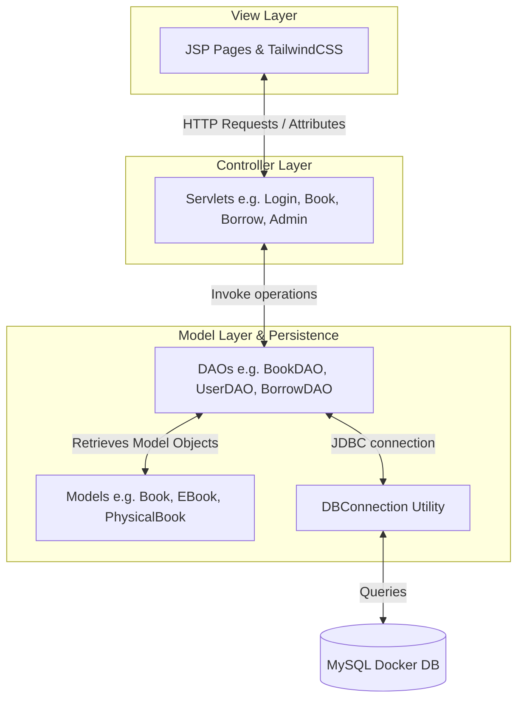

# UiTM PTAR eLibrary System

A modernized, responsive web-based library cataloguing and borrowing management system built for UiTM PTAR. This application utilizes **Jakarta Servlets (Jakarta EE 10)**, **JSP views styled with TailwindCSS**, and a **MySQL database containerized in Docker**.

---

## 🛠️ Technology Stack
* **Java Version:** JDK 17
* **Web Framework:** Jakarta Servlet API 5.0.0 & Jakarta Server Pages (JSP)
* **CSS Framework:** TailwindCSS v4
* **Database:** MySQL 9 (Docker Containerized)
* **Application Server:** Apache Tomcat 10 (via Cargo Maven Plugin)

---

## 🚀 Running the Project

### Step 1: Start the Database Container
Expose the MySQL service on port `3306` and initialize the schema automatically:
```bash
docker compose up -d
```
*This command mounts the `schema.sql` automatically to configure `elibrary_db` database and its tables.*

### Step 2: Build & Start Tomcat Web Server
Clean the targets, package the `.war` file, and deploy it to the embedded Tomcat server:
```bash
mvn clean package cargo:run
```
Once the server is running, access the landing page at:
* **`http://localhost:8080/UITMPTARELibrarySystem/`**

---

## 🛢️ Database Connection (DBeaver)
You can connect DBeaver or any other database client using these credentials:
* **Host:** `localhost`
* **Port:** `3306`
* **Database / Schema:** `elibrary_db`
* **Username:** `root`
* **Password:** `example`
* **Connection Properties:** Set `allowPublicKeyRetrieval` to `true` and `useSSL` to `false`.

---

## 📦 Mock Data Seeding (Factory Pattern)
The application has a built-in startup listener that automatically seeds the database if it is empty. If you ever need to forcefully clear all tables and re-populate the database with the target data structure (55 books, 10 student borrowers, 2 librarians, and sample borrowings), execute:
```bash
mvn compile exec:java -Dexec.mainClass="com.elibrary.util.DummyDataFactory"
```

### Mock Accounts:
* **Librarian (Admin) Login:**
  * Email: `ahmad@ptar.edu.my` | Password: `admin123`
  * Email: `siti@ptar.edu.my` | Password: `admin123`
* **Borrower (Student) Login:**
  * Email: `ali.abu@student.uitm.edu.my` | Password: `student123`
  * *(Up to 10 borrower accounts exist, following similar name.surname format)*

---

## 🏗️ Architecture Design



### Component Breakdown:
1. **Views (JSP & TailwindCSS):** Premium user interface designed with TailwindCSS. Guest browse, student borrow dashboard, and a librarian management dashboard.
2. **Controllers (Servlets):** Handles routing, session checking, business rules, and forwards parameters to/from view files.
3. **DAOs (Data Access Objects):** Hand-written JDBC persistence routines mapping result sets directly to Java objects.
4. **Models:** Represents entities like `Book`, subclasses `EBook` and `PhysicalBook`, `Borrower`, `Librarian`, and `Borrow`/`BorrowingDetail`.
